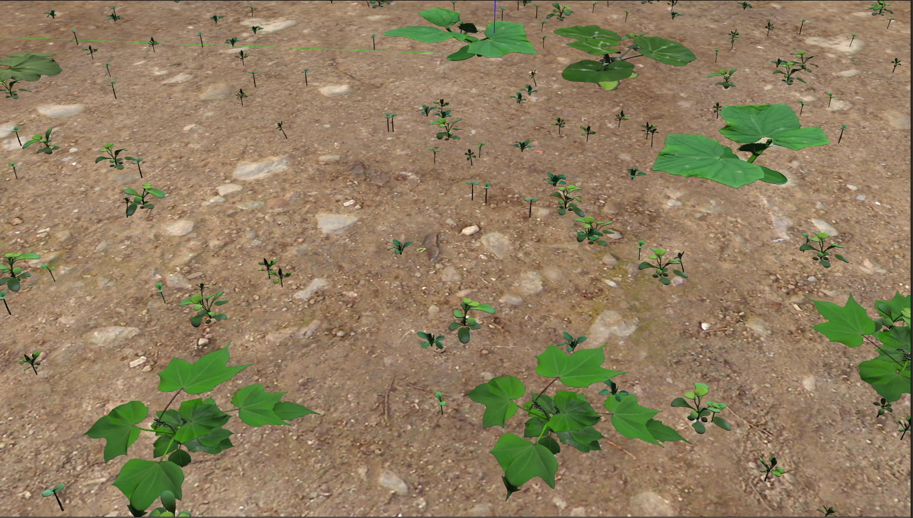

# virtual_farm_env


**Important Notice: Attribution and Origin**
> [!IMPORTANT]
> This repository is heavily based on and acts as a specialized adaptation of the **[virtual_maize_field](https://github.com/FieldRobotEvent/virtual_maize_field)** package originally developed for the Field Robot Event. 
> All credit for the foundational generator algorithms, and core design of this environment goes to the original authors. Please visit their GitHub repository for the original source:

> [FieldRobotEvent/virtual_maize_field](https://github.com/FieldRobotEvent/virtual_maize_field)

## Overview
`virtual_farm_env` is an optimized ROS Noetic agricultural environment toolkit adapted from `virtual_maize_field`. It focuses on streamlining the farm simulation by restricting models to photorealistic 3D models of cotton, weeds, and pumpkins, and eliminates collision checks for lighter deployment. The simulation is  that is for testing image processing algorithms.

During world generation, the engine will automatically utilize all available 3D crop models found in the `models/` directory and uniformly distribute the different varieties throughout the field.



## How to Run

1. Ensure you have sourced your ROS workspace:
   ```bash
   source devel/setup.bash
   ```

2. Construct your World using the generator python script and a valid YAML specifier:
   ```bash
   rosrun virtual_farm_env generate_world.py test_world
   ```

3. Start your Gazebo Simulation with the custom generated world:
   ```bash
   roslaunch virtual_farm_env simulation.launch
   ```

## Configuration
Inside the `config/` directory, you will find configurations such as `test_world.yaml`. You can customize the random spawn probabilities, sizes, spacing, crop selections, and total generated density before executing the generator script.
